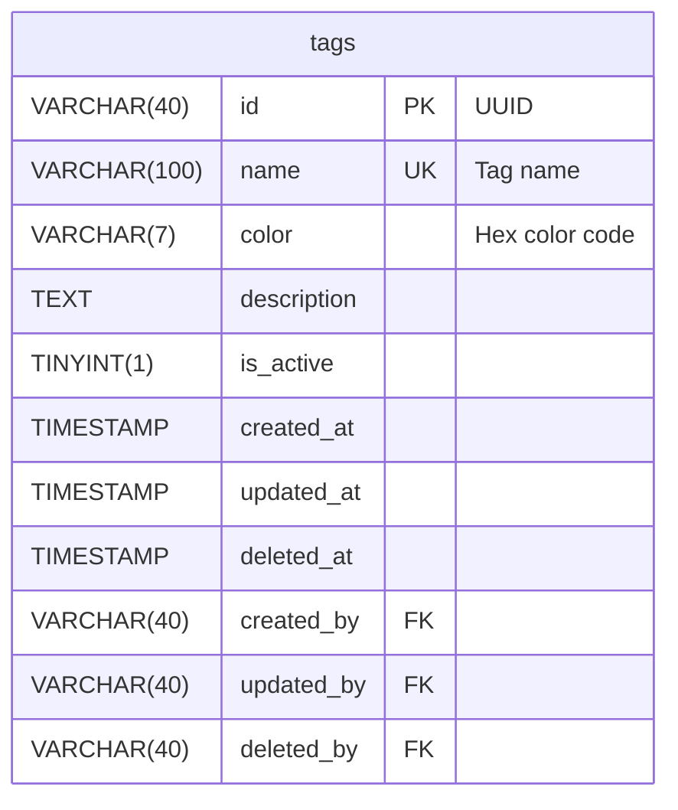

# Phase 1: CRUD Schema Generation (ERD + DBML)

## Objective

Generate both ERD and DBML for a simple CRUD entity in one phase.

## Prerequisites

- Entity name defined (singular)
- Attributes with types defined
- Constraints identified

## Implementation Steps

### Step 1: Validate Entity Name

- Convert to plural for table name (e.g., `tag` → `tags`)
- Ensure snake_case
- No prefixes

### Step 2: Generate ERD

Create Mermaid ERD:

```mermaid
erDiagram
    {table_name} {
        VARCHAR(40) id PK "UUID"
        {attributes...}
        TIMESTAMP created_at
        TIMESTAMP updated_at
        TIMESTAMP deleted_at
        VARCHAR(40) created_by FK
        VARCHAR(40) updated_by FK
        VARCHAR(40) deleted_by FK
    }
```

### Step 3: Generate DBML

Create DBML schema:

```dbml
Table {table_name} {
  id VARCHAR(40) [pk, note: 'UUID']
  {attributes...}
  created_at TIMESTAMP [not null]
  updated_at TIMESTAMP [not null]
  deleted_at TIMESTAMP [null]
  created_by VARCHAR(40)
  updated_by VARCHAR(40)
  deleted_by VARCHAR(40)
  
  indexes {
    {unique_columns} [unique, name: 'idx_{table}_{column}']
    deleted_at [name: 'idx_{table}_deleted_at']
  }
}
```

### Step 4: Add Standard Indexes

- Unique constraints
- `deleted_at`
- Common filters

### Step 5: Create Output Files

- ERD: `docs/database/erd/{entity_name}.mmd`
- DBML: `docs/database/dbml/{entity_name}.dbml`

## Example Output

**ERD (tags.mmd):**


**DBML (tags.dbml):**
```dbml
Table tags {
  id VARCHAR(40) [pk, note: 'UUID']
  name VARCHAR(100) [unique, not null, note: 'Tag name']
  color VARCHAR(7) [null, note: 'Hex color code']
  description TEXT [null]
  is_active TINYINT(1) [default: 1, not null]
  created_at TIMESTAMP [not null]
  updated_at TIMESTAMP [not null]
  deleted_at TIMESTAMP [null]
  created_by VARCHAR(40)
  updated_by VARCHAR(40)
  deleted_by VARCHAR(40)
  
  indexes {
    name [unique, name: 'idx_tags_name']
    deleted_at [name: 'idx_tags_deleted_at']
  }
}
```

## Validation

- [ ] ERD renders correctly
- [ ] DBML is valid
- [ ] All audit trail columns present
- [ ] Proper indexes added

## Next Phase

Proceed to Phase 2: CRUD PostgreSQL Migration
