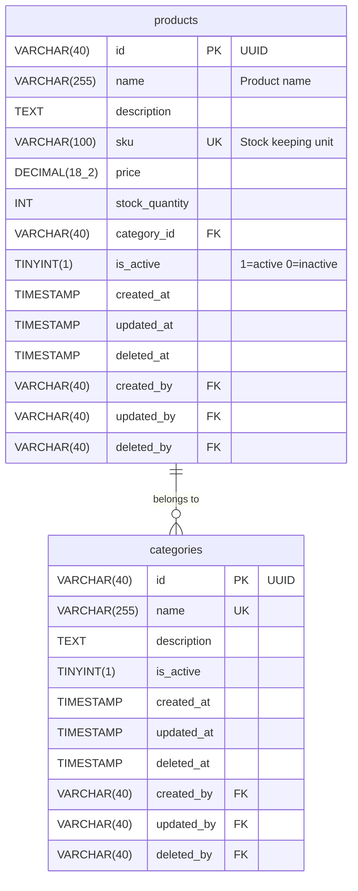

# Phase 1: Feature ERD Generation

## Objective

Generate Mermaid ERD diagram for the feature with all entities, relationships, and proper audit trail columns.

## Prerequisites

- Feature name defined
- Entities list confirmed
- Entity attributes defined with types
- Relationships identified

## Implementation Steps

### Step 1: Read DATABASE_STANDARDS.md

Review all database standards before generating ERD.

### Step 2: Validate Table Names

For each entity:
- Convert to plural form (e.g., `product` → `products`)
- Ensure snake_case format
- Check for NO prefixes (m_, t_, tbl_)
- Validate English spelling

### Step 3: Generate ERD Structure

Use Mermaid syntax from `shared/erd-template.md`:

```mermaid
erDiagram
    {table_name} {
        VARCHAR(40) id PK "UUID"
        {columns...}
        TIMESTAMP created_at
        TIMESTAMP updated_at
        TIMESTAMP deleted_at
        VARCHAR(40) created_by FK
        VARCHAR(40) updated_by FK
        VARCHAR(40) deleted_by FK
    }
```

### Step 4: Add Entity Attributes

For each attribute:
- Use proper data type (VARCHAR, DECIMAL, TINYINT, TEXT, TIMESTAMP)
- Add PK/FK/UK markers
- Include descriptions
- Ensure snake_case naming

### Step 5: Add Relationships

Define relationships between entities:
- `||--o{` for one-to-many
- `}o--o{` for many-to-many
- Include relationship labels

### Step 6: Validate Against Audit Standards

Run validation from `shared/database-audit-validator.md`:
- [ ] All tables have 6 audit trail columns
- [ ] All primary keys are VARCHAR(40)
- [ ] All table names are plural, snake_case, no prefixes
- [ ] All column names are snake_case
- [ ] Boolean columns have is_/has_/can_ prefix
- [ ] Foreign keys follow {table_singular}_id pattern

### Step 7: Create Output File

Save ERD to: `docs/database/erd/{feature_name}.mmd`

## Output Example



## Validation

- [ ] ERD renders correctly at https://mermaid.live
- [ ] All entities present
- [ ] All relationships shown
- [ ] All audit trail columns included
- [ ] No database audit violations

## Next Phase

Proceed to Phase 2: Feature DBML Generation
