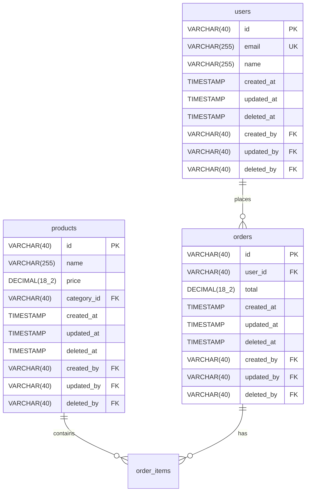

# Phase 2: Project ERD Generation

## Objective

Generate complete Mermaid ERD for entire project showing all features and their relationships.

## Prerequisites

- Phase 1 (Planning) completed
- All features identified
- All entities defined

## Implementation Steps

### Step 1: Generate ERD for Each Feature

For each feature, create entity definitions following `new-feature/01-feature-erd.md`.

### Step 2: Add Cross-Feature Relationships

Show relationships between features:
```mermaid
users ||--o{ orders : "places"
products ||--o{ order_items : "ordered in"
```

### Step 3: Group by Feature

Use comments to organize:
```mermaid
erDiagram
    %% User Management Feature
    users {
        ...
    }
    roles {
        ...
    }
    
    %% Product Catalog Feature
    products {
        ...
    }
    categories {
        ...
    }
```

### Step 4: Create Output File

Save to: `docs/database/erd/project-overview.mmd`

## Example Output



## Validation

- [ ] All features included
- [ ] All relationships shown
- [ ] ERD renders correctly

## Next Phase

Proceed to Phase 3: Project DBML Generation
