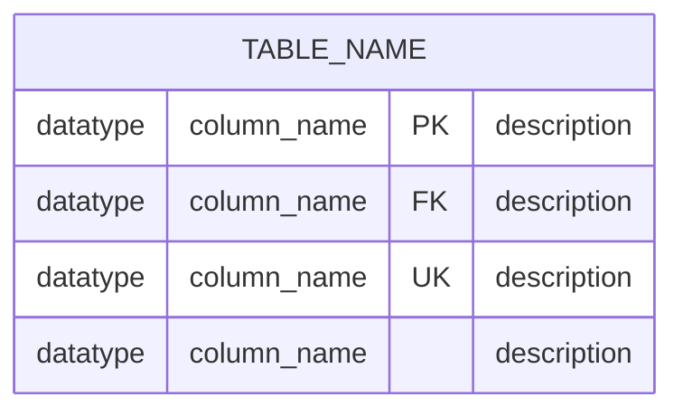
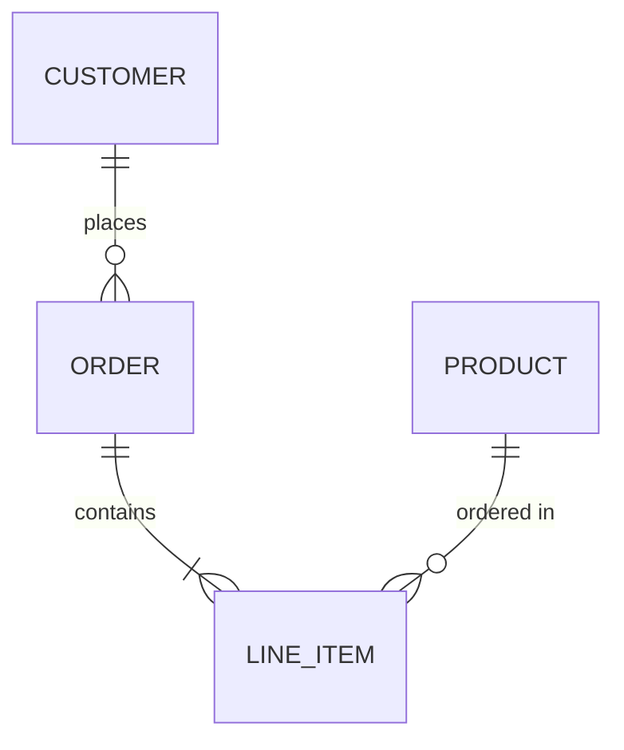
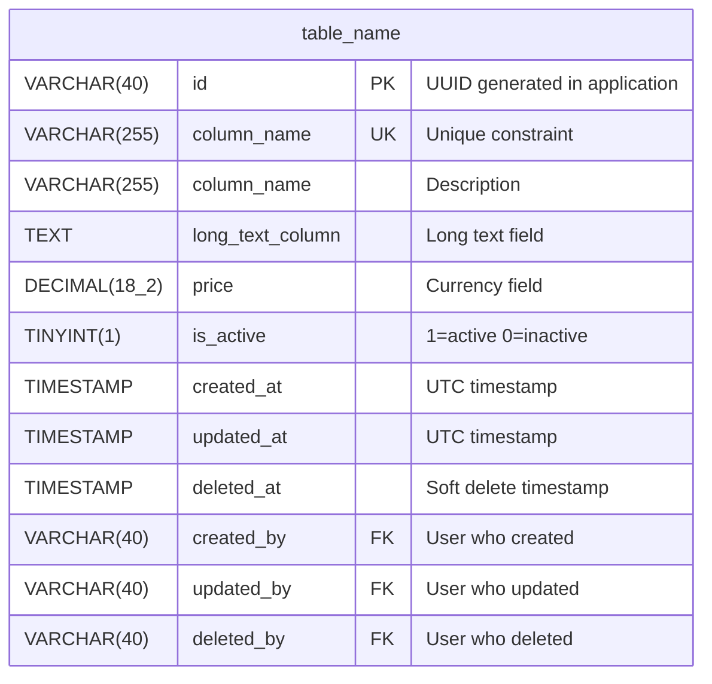
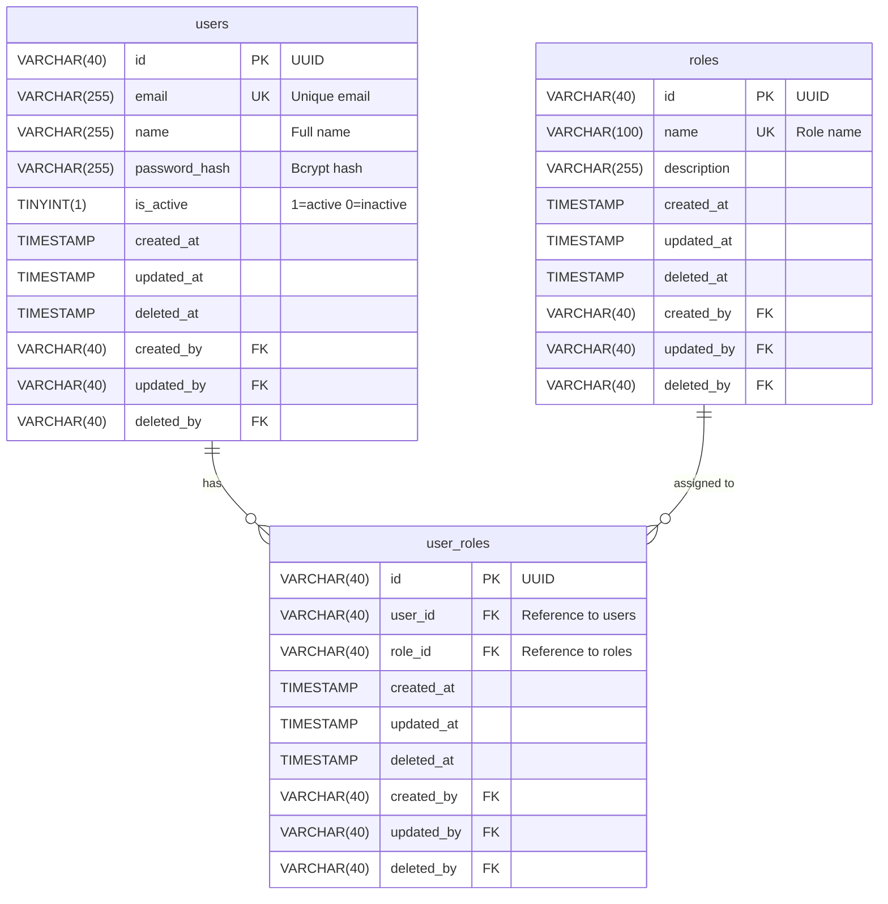
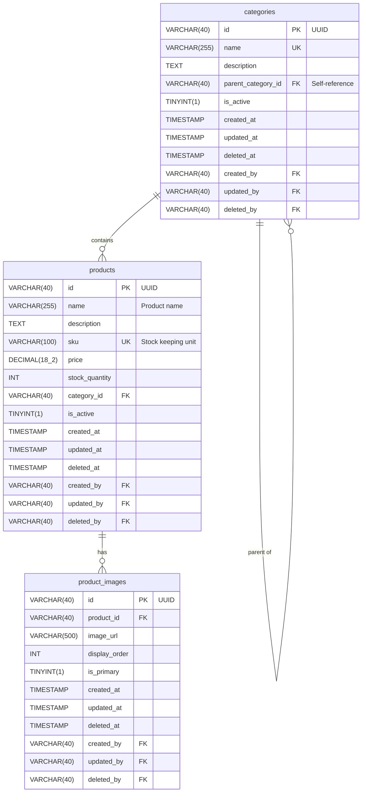
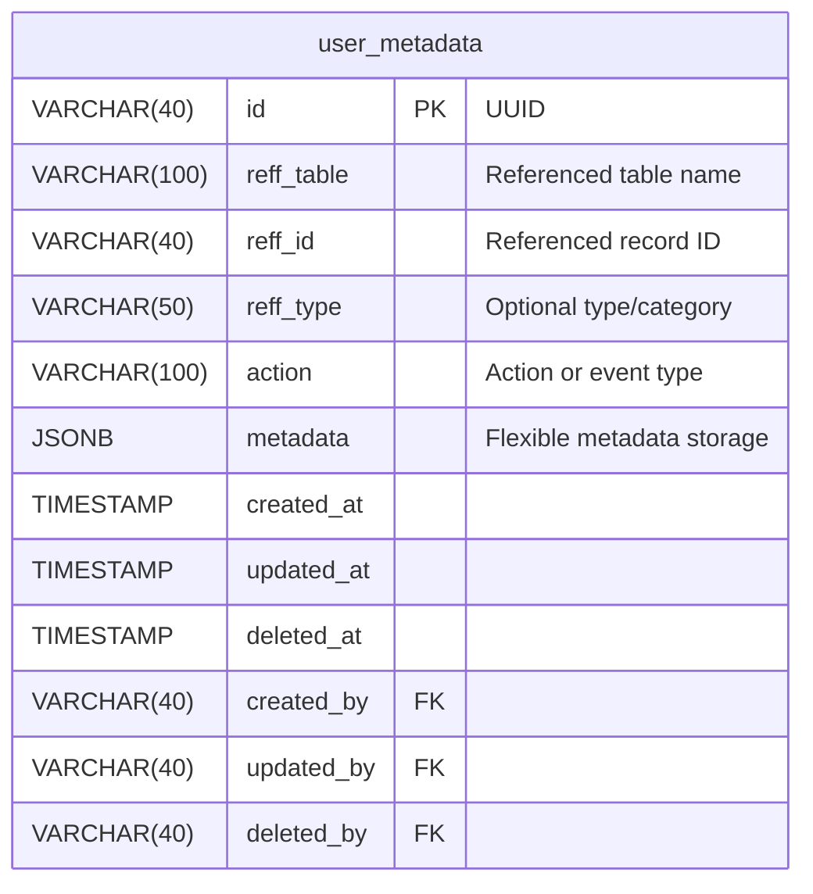
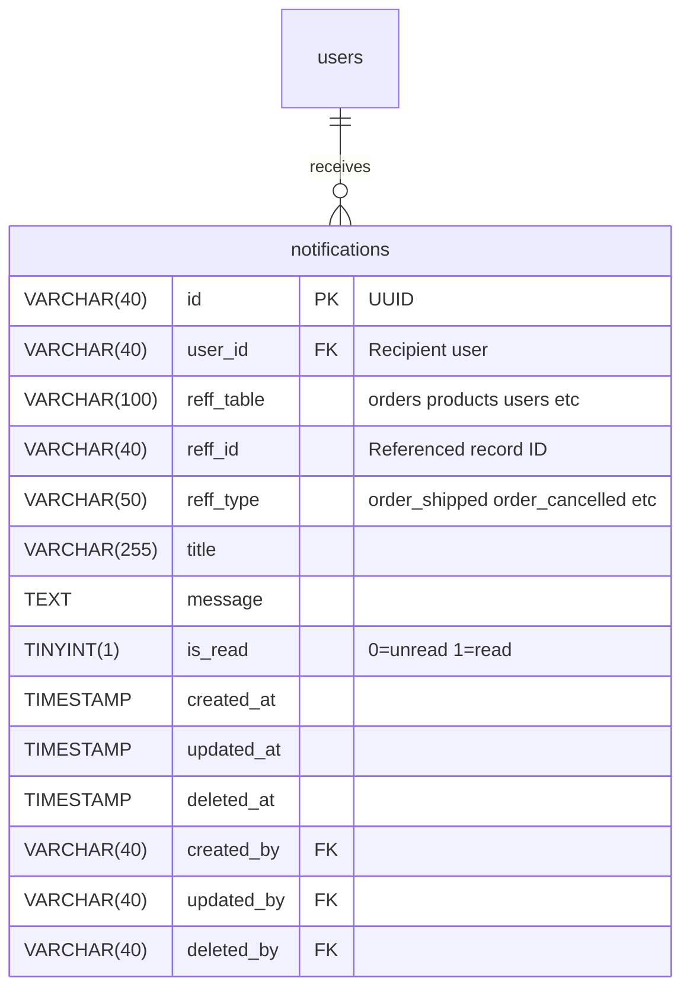

# ERD Template (Mermaid Syntax)

This file contains Mermaid ERD syntax templates and examples for generating Entity-Relationship Diagrams.

## Basic Syntax

## Relationship Syntax

**Cardinality:**
- `||--||` : One to one
- `||--o{` : One to many
- `}o--o{` : Many to many
- `||--o|` : One to zero or one

## Standard Table Template

## Example: User Management Feature

## Example: Product Catalog Feature

## Example: Metadata Table Pattern

## Example: Polymorphic Reference Pattern

## Important Notes

1. **Always include audit trail columns** (created_at, updated_at, deleted_at, created_by, updated_by, deleted_by)
2. **Use VARCHAR(40) for all IDs** (UUID storage)
3. **Use descriptive comments** for clarity
4. **Show relationships** between tables
5. **NO foreign key constraints** (relationships are documentation only)
6. **Use proper data types** (DECIMAL for currency, TINYINT for boolean)

## Testing

Test your Mermaid ERD at: https://mermaid.live
