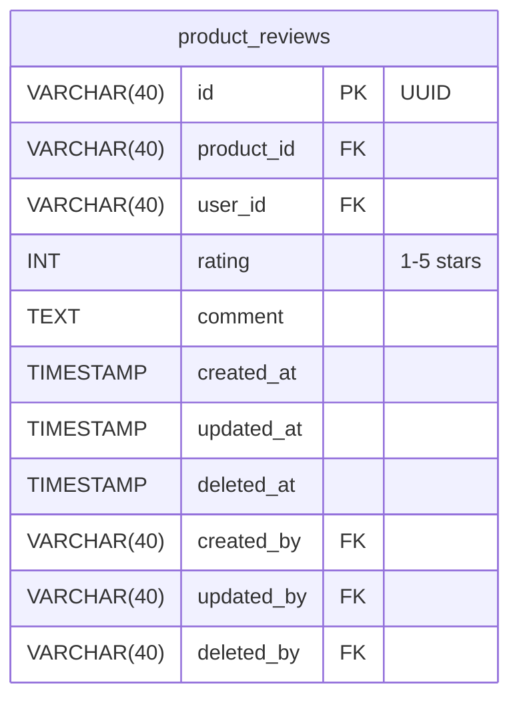
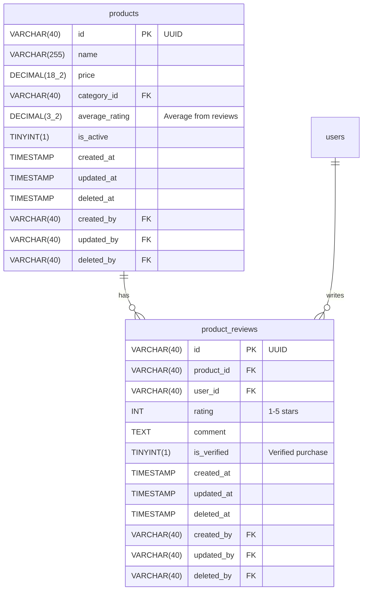

# Phase 2: Update ERD

## Objective

Update Mermaid ERD with new entities, columns, and relationships while maintaining existing design.

## Prerequisites

- Phase 1 (Load Existing) completed
- Changes validated

## Implementation Steps

### Step 1: Load Current ERD

Read existing `docs/database/erd/{feature_name}.mmd`

### Step 2: Apply Entity Changes

**Adding New Entities:**


**Modifying Existing Entities:**
```mermaid
    products {
        VARCHAR(40) id PK "UUID"
        VARCHAR(255) name
        DECIMAL(18_2) price
        DECIMAL(3_2) average_rating "NEW: Average rating"
        %% ... rest of columns
    }
```

**Removing Entities:**
- Comment out or remove entity definition
- Document in migration for reference

### Step 3: Update Relationships

Add new relationships:
```mermaid
    products ||--o{ product_reviews : "has"
    users ||--o{ product_reviews : "writes"
```

Remove old relationships if needed.

### Step 4: Validate Updated ERD

Check:
- [ ] All new entities have audit trail columns
- [ ] All new columns follow naming conventions
- [ ] Relationships are correctly defined
- [ ] No database audit violations

### Step 5: Save Updated ERD

Overwrite existing file: `docs/database/erd/{feature_name}.mmd`

## Example Output



## Validation

- [ ] ERD renders correctly at https://mermaid.live
- [ ] All changes applied
- [ ] Audit standards maintained

## Next Phase

Proceed to Phase 3: Update DBML
