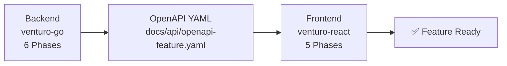

# venturo-react

React frontend development automation for Venturo skeleton projects.

## Overview

Provides guided, interactive workflows for creating React frontend features from OpenAPI specifications. Each command implements a phase-based incremental workflow that breaks complex tasks into manageable steps.

## Commands

### Feature Development

#### `/venturo-react:new-feature`
Create complete React feature from OpenAPI specification

**Use for**: Creating frontend features that integrate with backend APIs documented in OpenAPI YAML

**Creates**:
- API Layer (TypeScript types, API functions, React Query hooks)
- Feature Components (Table, Form, Filters, FilterDrawer)
- Feature Hooks (Table logic, Form logic)
- Page Integration (Main page, Routes, Sidebar)
- Permissions & Constants

**Workflow**: 5-phase incremental implementation
1. API Layer
2. Feature Components
3. Feature Hooks
4. Page Integration & Routes
5. Permissions & Constants

---

## Architecture

Each command follows a phase-based incremental workflow:

### Phase Structure

```
1. Discovery - Parse OpenAPI spec, ask clarifying questions
2. Planning - Present complete implementation plan
3. Implementation - Execute systematic phases
4. Validation - Stop after each phase for review
5. Continuation - User says "continue" to proceed
6. Quality Checks - Verify TypeScript, ESLint, formatting
```

### Benefits

- **Type Safety**: TypeScript interfaces match backend exactly
- **Context-efficient**: Break large tasks into smaller chunks
- **Validation**: Review output after each phase
- **Consistency**: Same patterns across all features
- **Integration**: Seamless backend-frontend integration via OpenAPI

---

## Project Structure

```
src/
├── app/
│   ├── api/                 # API Layer
│   │   └── {feature}/
│   │       ├── type.ts              # TypeScript types from OpenAPI
│   │       ├── {feature}Api.ts      # API endpoint functions
│   │       ├── use{Feature}Api.ts   # React Query hooks
│   │       └── index.ts
│   ├── constants/
│   │   ├── permission.ts    # Permission constants
│   │   └── router.ts        # Route constants
│   └── routes/
│       ├── Router.tsx       # Route registration
│       └── SideBarData.ts   # Sidebar menu items
├── features/
│   └── {feature}/
│       ├── components/      # Feature components
│       │   ├── {Feature}Table.tsx
│       │   ├── {Feature}Form.tsx
│       │   ├── {Feature}Filters.tsx
│       │   └── {Feature}FilterDrawer.tsx
│       ├── hooks/           # Feature hooks
│       │   ├── useTable{Feature}.ts
│       │   └── useForm{Feature}.ts
│       └── {Feature}Page.tsx
```

---

## Quick Start

### Create a feature from OpenAPI spec
```bash
/venturo-react:new-feature
```

Claude will:
1. Ask for the OpenAPI YAML file path
2. Parse the spec to extract schemas, endpoints, and permissions
3. Ask about feature naming preferences
4. Present a complete implementation plan
5. Guide you through 5 implementation phases

**Example:**
```
User: /venturo-react:new-feature

Claude: I'll help you create a new frontend feature from an OpenAPI specification.

        1. What is the path to the OpenAPI YAML file?

User: /path/to/openapi-customer_management.yaml

Claude: [Analyzes spec and asks remaining questions]
        [Presents implementation plan]

User: Yes, proceed

Claude: [Executes Phase 1: API Layer]
        ✅ Phase 1 Complete

        Created:
        - src/app/api/customer/type.ts
        - src/app/api/customer/customerApi.ts
        - src/app/api/customer/useCustomerApi.ts
        - src/app/api/customer/index.ts

        Say "continue" to proceed to Phase 2.

User: continue

[Claude continues through all 5 phases]
```

---

## Backend-Frontend Integration

The plugin integrates seamlessly with the `venturo-go` plugin through OpenAPI specifications:



**Integration Flow:**
1. Backend team creates feature using `/venturo-go:new-feature`
2. Backend generates OpenAPI YAML documentation
3. Frontend team uses `/venturo-react:new-feature` with the OpenAPI YAML
4. Frontend feature is generated with type-safe API integration

For detailed integration flow, see: `phases/shared/backend-frontend-integration-flow.md`

---

## File Naming Conventions

All files follow consistent naming patterns:

- **API Types**: `type.ts` (in feature API folder)
- **API Functions**: `{feature}Api.ts` (e.g., `customerApi.ts`)
- **React Query Hooks**: `use{Feature}Api.ts` (e.g., `useCustomerApi.ts`)
- **Components**: `{Feature}{Component}.tsx` (e.g., `CustomerTable.tsx`)
- **Feature Hooks**: `use{Action}{Feature}.ts` (e.g., `useTableCustomer.ts`)
- **Page**: `{Feature}Page.tsx` (e.g., `CustomerPage.tsx`)

---

## Key Implementation Patterns

### TypeScript Types from OpenAPI
```typescript
// Generated from OpenAPI schemas
export interface Customer {
  id: string;
  name: string;
  email: string;
  status: 'active' | 'inactive';  // Enum from OpenAPI
  created_at: string;
}
```

### API Service Pattern
```typescript
// Uses centralized apiService
import { apiService } from '@/app/services/apiService';

export const customerApi = {
  createCustomer: (data: CreateCustomerData) =>
    apiService.post<ResponseApi<Customer>>('/core/v1/customers', data),
};
```

### React Query Hooks Pattern
```typescript
// Query keys factory pattern
export const customerKeys = {
  all: ['customers'] as const,
  lists: () => [...customerKeys.all, 'list'] as const,
  list: (params?: ListCustomersParams) => [...customerKeys.lists(), params] as const,
};

export const useGetListCustomers = (params?: ListCustomersParams) => {
  return useQuery({
    queryKey: customerKeys.list(params),
    queryFn: () => customerApi.listCustomers(params),
  });
};
```

### Permission Checks
```typescript
// Use permission constants and hooks
import { usePermission } from '@/shared/hooks';
import { PERMISSIONS } from '@/app/constants/permission';

const { hasPermission } = usePermission();
const canCreate = hasPermission(PERMISSIONS.CUSTOMER_CREATE);
```

---

## Code Quality Standards

All commands ensure:

- **Type Safety**: No TypeScript errors (`npm run type-check`)
- **Linting**: No ESLint warnings (`npm run lint`)
- **Formatting**: Prettier formatting (`npm run format`)
- **Absolute Imports**: Use `@/` prefix for all imports
- **Component Library**: Use venturo-ui instead of raw MUI

---

## Requirements

- React 18+
- TypeScript 5+
- Venturo React Skeleton project
- Claude Code with plugin support
- OpenAPI 3.0+ specification from backend

---

## Examples

### Example 1: Create Customer Management Feature
```
/venturo-react:new-feature

> OpenAPI file: /backend/docs/api/openapi-customer_management.yaml
> Feature name: customer
> Base path: /core/v1/customers

[Claude guides through 5 phases, creating complete feature with:
- TypeScript types for Customer entity
- API functions for CRUD operations
- React Query hooks for data fetching
- Table, Form, and Filter components
- Complete page with permissions]
```

### Example 2: Create Product Catalog Feature
```
/venturo-react:new-feature

> OpenAPI file: /backend/docs/api/openapi-product_catalog.yaml
> Feature name: product
> Components: Table, Form, Filters, FilterDrawer
> Additional features: Export CSV, Bulk operations

[Claude creates feature with all specified components]
```

---

## Phase Details

### Phase 1: API Layer (~5 minutes)
- Creates TypeScript types from OpenAPI schemas
- Generates API endpoint functions
- Creates React Query hooks (useGet, usePost, usePut, useDelete)
- Sets up query keys factory pattern

### Phase 2: Feature Components (~7 minutes)
- Creates Table component with pagination
- Creates Form component (Create/Edit dialog)
- Creates Filters component (search bar)
- Creates FilterDrawer component (advanced filters)

### Phase 3: Feature Hooks (~3 minutes)
- Creates useTable{Feature} hook for table logic
- Creates useForm{Feature} hook for form logic
- Integrates API hooks with UI state

### Phase 4: Page Integration & Routes (~3 minutes)
- Creates main {Feature}Page component
- Registers routes in Router.tsx
- Adds sidebar menu items

### Phase 5: Permissions & Constants (~2 minutes)
- Adds permission constants
- Adds route constants
- Applies permission guards to page

**Total Time**: 15-20 minutes per feature

---

## Support & Documentation

- **Plugin Issues**: https://github.com/venturo-id/venturo-claude/issues
- **Venturo Skeleton**: https://github.com/venturo-id/venturo-react-skeleton
- **Integration Guide**: See `phases/shared/backend-frontend-integration-flow.md`

---

## License

MIT License - see LICENSE file for details

---

## Version

1.0.0

---

**Developed by Venturo** - Professional development tools for React frontend engineering
