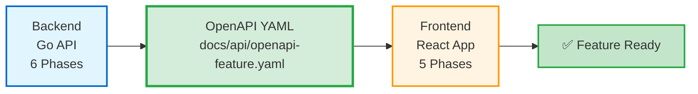
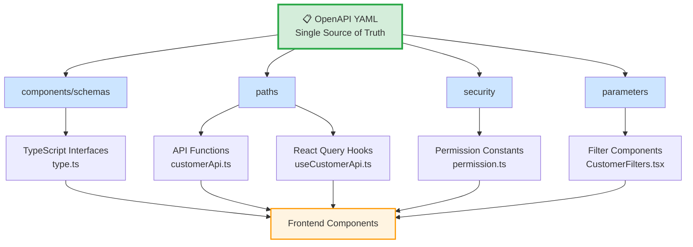
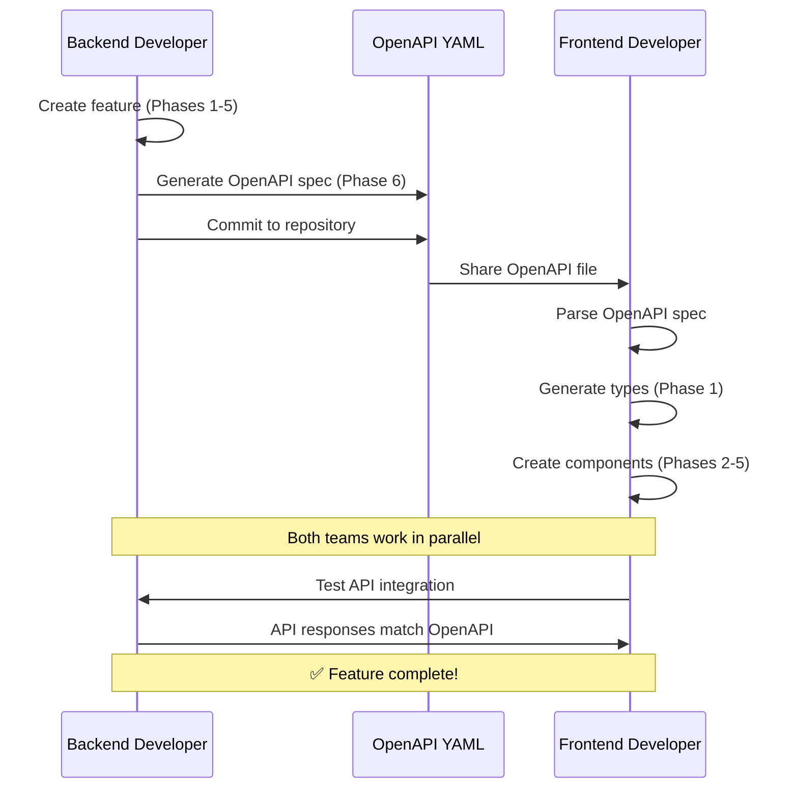

# Backend-Frontend Integration Flow

## Overview

This document illustrates how the backend (Go) and frontend (React) feature creation processes integrate through OpenAPI specifications.

---

## Simple Flow



### Summary
1. **Backend Team**: Creates API feature (6 phases) → Generates OpenAPI YAML
2. **OpenAPI YAML**: Acts as contract/specification between backend and frontend
3. **Frontend Team**: Uses OpenAPI YAML to generate frontend feature (5 phases)

---

## Detailed Integration Flow

```mermaid
flowchart TD
    Start([👨‍💻 Developer: Create New Feature]) --> Backend[🔷 Backend: Go API]

    Backend --> B1[Phase 1: Planning & Migration<br/>📋 Create DB schema<br/>📁 Directory structure<br/>🗄️ SQL migrations]
    B1 --> B2[Phase 2: Domain Layer<br/>🏗️ Entities<br/>📦 DTOs Request/Response<br/>⚠️ Custom errors]
    B2 --> B3[Phase 3: Repository Layer<br/>💾 CRUD operations<br/>🔍 Query methods<br/>🔗 Database access]
    B3 --> B4[Phase 4: Service Layer<br/>💼 Business logic<br/>✅ Validation<br/>🔄 Transaction handling]
    B4 --> B5[Phase 5: HTTP Handler & Routes<br/>🌐 REST endpoints<br/>🔐 Middleware auth<br/>📥 Request binding]
    B5 --> B6[Phase 6: Documentation<br/>📄 Generate OpenAPI YAML<br/>📝 Schemas, paths, responses]

    B6 --> Integration{{📋 OpenAPI YAML File<br/>docs/api/openapi-feature.yaml<br/><br/>Contains:<br/>• Schemas components<br/>• API paths endpoints<br/>• Request/Response types<br/>• Query parameters<br/>• Permissions required<br/>• Enum values}}

    Integration --> Frontend[🔶 Frontend: React App]

    Frontend --> F0[📖 Parse OpenAPI Spec<br/>🔍 Extract schemas<br/>🔍 Extract endpoints<br/>🔍 Extract permissions]

    F0 --> F1[Phase 1: API Layer<br/>📘 TypeScript types from schemas<br/>🔌 API functions customerApi.ts<br/>🪝 React Query hooks useCustomerApi.ts]
    F1 --> F2[Phase 2: Feature Components<br/>📊 CustomerTable.tsx pagination<br/>📝 CustomerForm.tsx create/edit<br/>🔍 CustomerFilters.tsx search<br/>🎛️ CustomerFilterDrawer.tsx advanced filters]
    F2 --> F3[Phase 3: Feature Hooks<br/>🪝 useTableCustomer.ts table logic<br/>🪝 useFormCustomer.ts form logic<br/>📊 State management<br/>✅ Validation logic]
    F3 --> F4[Phase 4: Page & Routes<br/>📄 CustomerPage.tsx main page<br/>🛤️ Register routes Router.tsx<br/>📑 Add sidebar menu SidebarItems.ts]
    F4 --> F5[Phase 5: Permissions & Constants<br/>🔐 Permission constants<br/>🛡️ Permission guards<br/>🚦 Route protection]

    F5 --> Complete([✅ Feature Complete<br/>Backend + Frontend Integrated])

    style Backend fill:#e1f5ff,stroke:#0066cc,stroke-width:2px
    style Frontend fill:#fff4e1,stroke:#ff9800,stroke-width:2px
    style Integration fill:#d4edda,stroke:#28a745,stroke-width:4px
    style B6 fill:#90ee90,stroke:#28a745,stroke-width:2px
    style F0 fill:#ffeb99,stroke:#ff9800,stroke-width:2px
    style Complete fill:#c3e6cb,stroke:#28a745,stroke-width:3px
```



---

## Phase-by-Phase Comparison

### Backend Phases (Go)

| Phase | Purpose | Output |
|-------|---------|--------|
| **Phase 1** | Planning & Migration | Database schema, migrations |
| **Phase 2** | Domain Layer | Entities, DTOs, error definitions |
| **Phase 3** | Repository Layer | Data access operations |
| **Phase 4** | Service Layer | Business logic implementation |
| **Phase 5** | HTTP Handler & Routes | REST API endpoints |
| **Phase 6** | Documentation | **OpenAPI YAML file** |

### Frontend Phases (React)

| Phase | Purpose | Input Source (from OpenAPI) |
|-------|---------|------------------------------|
| **Phase 1** | API Layer | Schemas → Types, Paths → Endpoints |
| **Phase 2** | Feature Components | Response schemas → Component props |
| **Phase 3** | Feature Hooks | Query parameters → Filter logic |
| **Phase 4** | Page & Routes | Paths → Route configuration |
| **Phase 5** | Permissions | Security schemes → Permission constants |

---

## OpenAPI as Integration Contract



---

## What Gets Transferred via OpenAPI

### 1. Schemas → TypeScript Types

**Backend (OpenAPI):**
```yaml
components:
  schemas:
    Customer:
      type: object
      required:
        - name
        - email
      properties:
        id:
          type: string
          format: uuid
        name:
          type: string
        email:
          type: string
          format: email
        status:
          type: string
          enum: [active, inactive]
        created_at:
          type: string
          format: date-time
```

**Frontend (TypeScript):**
```typescript
// src/app/api/customer/type.ts
export interface Customer {
  id: string;
  name: string;
  email: string;
  status: 'active' | 'inactive';
  created_at: string;
}
```

---

### 2. Paths → API Endpoints

**Backend (OpenAPI):**
```yaml
paths:
  /core/v1/customers:
    get:
      summary: List customers
      parameters:
        - name: page
          in: query
          schema:
            type: integer
        - name: limit
          in: query
          schema:
            type: integer
    post:
      summary: Create customer
      requestBody:
        content:
          application/json:
            schema:
              $ref: '#/components/schemas/CreateCustomerRequest'
```

**Frontend (TypeScript):**
```typescript
// src/app/api/customer/customerApi.ts
export const customerApi = {
  listCustomers: (params?: ListCustomersParams) =>
    apiService.get<ResponseApiWithMeta<Customer[]>>('/core/v1/customers', params),

  createCustomer: (data: CreateCustomerData) =>
    apiService.post<ResponseApi<Customer>>('/core/v1/customers', data),
};
```

---

### 3. Parameters → React Query Hooks

**Frontend (TypeScript):**
```typescript
// src/app/api/customer/useCustomerApi.ts
export const customerKeys = {
  all: ['customers'] as const,
  lists: () => [...customerKeys.all, 'list'] as const,
  list: (params?: ListCustomersParams) => [...customerKeys.lists(), params] as const,
};

export const useGetListCustomers = (
  params?: ListCustomersParams
) => {
  return useQuery({
    queryKey: customerKeys.list(params),
    queryFn: () => customerApi.listCustomers(params),
  });
};
```

---

### 4. Security → Permissions

**Backend (OpenAPI):**
```yaml
paths:
  /core/v1/customers:
    post:
      summary: Create customer
      security:
        - BearerAuth: []
      x-permissions:
        - customers.create
```

**Frontend (TypeScript):**
```typescript
// src/app/constants/permission.ts
export const PERMISSIONS = {
  CUSTOMER_CREATE: 'customers.create',
  CUSTOMER_VIEW: 'customers.read',
  CUSTOMER_EDIT: 'customers.update',
  CUSTOMER_DELETE: 'customers.delete',
} as const;
```

---

## Integration Mapping Table

| Backend Output | OpenAPI Section | Frontend Input | Frontend Location |
|----------------|-----------------|----------------|-------------------|
| Entity structs | `components/schemas` | TypeScript interfaces | `src/app/api/{feature}/type.ts` |
| Request DTOs | `components/schemas` | Request types | `src/app/api/{feature}/type.ts` |
| Response DTOs | `components/schemas` | Response types | `src/app/api/{feature}/type.ts` |
| HTTP endpoints | `paths` | API functions | `src/app/api/{feature}/{feature}Api.ts` |
| Route handlers | `paths` (GET/POST/PUT/DELETE) | React Query hooks | `src/app/api/{feature}/use{Feature}Api.ts` |
| Query parameters | `parameters` | Filter params | Components & Hooks |
| Permission checks | `security` / `x-permissions` | Permission constants | `src/app/constants/permission.ts` |
| Enum values | `enum` in schemas | Union types | TypeScript types |
| Validation rules | `required`, `minLength`, etc. | Form validation | React Hook Form schemas |

---

## End-to-End Example: Customer Feature

### Step 1: Backend Development (Go)

```
Developer: "Create new feature, read new-feature-instruction.md"

Claude AI Backend:
├─ Phase 1: Create customers table migration
├─ Phase 2: Create Customer entity, DTOs
├─ Phase 3: Create CustomerRepository
├─ Phase 4: Create CustomerService
├─ Phase 5: Create CustomerHandler, register routes
└─ Phase 6: Generate openapi-customer_management.yaml
```

**Output:** `docs/api/openapi-customer_management.yaml`

---

### Step 2: Share OpenAPI Spec

Backend team shares the OpenAPI YAML file:
- Via Git repository
- Via documentation portal
- Via Slack/Teams message
- Via API documentation site

---

### Step 3: Frontend Development (React)

```
Developer: "Create new feature from OpenAPI, read new-feature-instruction.md"

Claude AI Frontend:
📋 Question: What is the path to the OpenAPI YAML file?
👤 Developer: /path/to/openapi-customer_management.yaml

Claude AI parses OpenAPI and creates:
├─ Phase 1: API Layer
│   ├─ type.ts (Customer, CreateCustomerData, ListCustomersParams)
│   ├─ customerApi.ts (createCustomer, listCustomers, etc.)
│   └─ useCustomerApi.ts (usePostCustomers, useGetListCustomers, etc.)
├─ Phase 2: Feature Components
│   ├─ CustomerTable.tsx
│   ├─ CustomerForm.tsx
│   ├─ CustomerFilters.tsx
│   └─ CustomerFilterDrawer.tsx
├─ Phase 3: Feature Hooks
│   ├─ useTableCustomer.ts
│   └─ useFormCustomer.ts
├─ Phase 4: Page & Routes
│   ├─ CustomerPage.tsx
│   ├─ Update Router.tsx
│   └─ Update SidebarItems.ts
└─ Phase 5: Permissions
    ├─ Update permission.ts
    └─ Add permission guards
```

---

## Benefits of This Integration

### 🎯 Type Safety
- Frontend types match backend exactly
- Compile-time error detection
- IDE autocomplete support

### ✅ Consistency
- Same validation rules on frontend and backend
- Same enum values
- Same field names and types

### 📚 Documentation
- OpenAPI serves as living documentation
- Frontend developers understand API without guessing
- API changes are immediately visible

### ⚡ Development Speed
- Frontend can start as soon as OpenAPI is ready
- No need to wait for backend completion
- Parallel development possible

### 🔄 Maintainability
- Single source of truth (OpenAPI)
- Easy to track API changes
- Version control for API contracts

---

## Common Integration Workflow



---

## Validation Checklist

### Backend Verification
- [ ] OpenAPI YAML generated successfully
- [ ] All endpoints documented in OpenAPI
- [ ] All schemas include required fields
- [ ] Security schemes defined (JWT, permissions)
- [ ] Response examples provided
- [ ] Enums defined for status fields
- [ ] File committed to `docs/api/openapi-{feature}.yaml`

### Frontend Verification
- [ ] TypeScript types match OpenAPI schemas
- [ ] All API endpoints have corresponding functions
- [ ] React Query hooks follow naming conventions
- [ ] Permission constants match OpenAPI security
- [ ] Form validation matches OpenAPI constraints
- [ ] Enum values match backend definitions
- [ ] No TypeScript errors (`npm run type-check`)
- [ ] No ESLint warnings (`npm run lint`)

---

## Troubleshooting

### Issue: Types Don't Match

**Symptom:** TypeScript errors when calling API
**Solution:** Regenerate types from latest OpenAPI spec

### Issue: Missing Endpoints

**Symptom:** API function not found
**Solution:** Check if endpoint exists in OpenAPI YAML

### Issue: Permission Denied

**Symptom:** 403 Forbidden errors
**Solution:** Verify permission constants match OpenAPI security definitions

### Issue: Enum Values Mismatch

**Symptom:** Invalid enum value errors
**Solution:** Ensure frontend enum matches backend OpenAPI enum exactly

---

## Best Practices

1. **Version Control**: Commit OpenAPI YAML to Git
2. **Naming Consistency**: Use same entity names on backend and frontend
3. **Regular Sync**: Update OpenAPI when backend changes
4. **Validation**: Run OpenAPI validators before sharing
5. **Documentation**: Add descriptions to OpenAPI schemas
6. **Examples**: Include request/response examples in OpenAPI
7. **Changelog**: Document API changes in CHANGELOG.md
8. **Review Process**: Review OpenAPI changes in pull requests

---

## Tools & Resources

### OpenAPI Validators
- [Swagger Editor](https://editor.swagger.io/) - Online OpenAPI editor
- [Spectral](https://stoplight.io/open-source/spectral) - OpenAPI linter
- [openapi-generator](https://openapi-generator.tech/) - Code generation tool

### Documentation Viewers
- [Swagger UI](https://swagger.io/tools/swagger-ui/) - Interactive API documentation
- [Redoc](https://redocly.com/redoc/) - Beautiful API documentation
- [Stoplight](https://stoplight.io/) - API design platform

---

## Conclusion

The OpenAPI specification acts as the **contract** between backend and frontend teams:

1. Backend creates the feature and generates OpenAPI YAML
2. OpenAPI YAML defines types, endpoints, and permissions
3. Frontend uses OpenAPI to generate type-safe API layer
4. Both teams stay in sync through the shared specification

This integration ensures **type safety**, **consistency**, and **faster development** across the entire stack.
